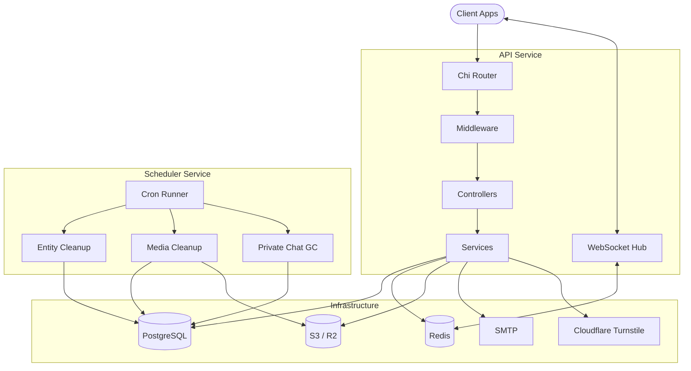
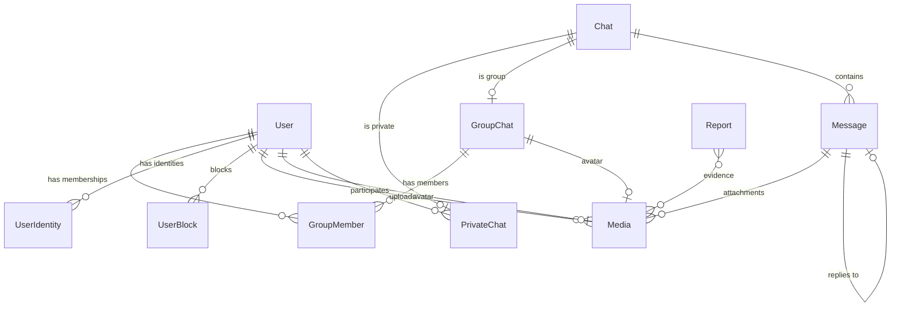

# AtoiTalkAPI

RESTful API for real-time chat applications. Handles authentication, private/group messaging, media uploads, WebSocket events, and background cleanup jobs. Built with Go, PostgreSQL, Redis, and S3-compatible storage.

See [AtoiTalk](https://github.com/ScrKiddie/AtoiTalk) for an example frontend.

## Architecture

The system runs as two separate services sharing the same codebase and database:



**API service** handles all HTTP endpoints and WebSocket connections. Manages authentication, chat operations, media, admin actions, and real-time event broadcasting.

**Scheduler service** runs periodic cleanup jobs in the background. Hard-deletes expired soft-deleted entities, removes orphaned media from S3, and garbage-collects abandoned private chats. Deliberately skips database migrations to avoid race conditions with the API.

## Data Model



## Features

### Auth & Accounts

- Email/password registration with OTP email verification
- Google OAuth login
- JWT-based session management with token blacklisting
- Password reset via OTP
- Cloudflare Turnstile captcha on sensitive endpoints
- Account deletion (soft delete with configurable retention)

### Messaging

- Private 1-on-1 chats
- Group chats with roles (owner, admin, member)
- Text messages with file/image attachments
- Message editing and deletion
- Read receipts and unread counts
- Chat delete

### Groups

- Public and private groups
- Invite links with reset capability
- Member management (kick, role changes, ownership transfer)
- Group dissolution
- Searchable public group directory

### Real-Time

- WebSocket connection with JWT auth
- Events: `message.new`, `message.update`, `message.delete`, `chat.new`, `chat.read`, `chat.typing`, `user.online`, `user.offline`, `user.update`, `user.block`, `user.banned`, `user.deleted`, and more
- Redis pub/sub for horizontal scaling across multiple API instances
- Online presence tracking with TTL-based keepalive

### Media

- File upload to S3-compatible storage (tested with Cloudflare R2)
- Public and private buckets
- Presigned URLs for private file access
- Orphan media cleanup by scheduler

### Admin

- Dashboard stats
- User management (view, ban, unban, reset profile)
- Group management (view, dissolve, reset info)
- Report system (view, resolve, delete)

### Scheduler Jobs

- **Entity cleanup**: hard-deletes users and chats past the soft-delete retention period
- **Private chat GC**: removes abandoned private chats where both users are gone
- **Media cleanup**: deletes orphaned files from S3 and database

## Tech Stack

| Layer | Technology |
|---|---|
| Language | Go 1.25 |
| Router | Chi v5 |
| ORM | Ent |
| Database | PostgreSQL |
| Cache / PubSub | Redis |
| Storage | S3 (Cloudflare R2) |
| Auth | JWT, Google OAuth2, bcrypt |
| WebSocket | gorilla/websocket |
| Validation | go-playground/validator |
| Email | SMTP (Mailtrap for dev) |
| Scheduler | robfig/cron |
| Docs | Swagger (swag), AsyncAPI |
| Captcha | Cloudflare Turnstile |

## Project Structure

```
cmd/
├── api/              # API server entrypoint
└── scheduler/        # Scheduler entrypoint

internal/
├── adapter/          # External service adapters (S3, email, captcha, Redis)
├── bootstrap/        # Dependency wiring and route registration
├── config/           # App config, Ent init, Chi setup, S3 client
├── constant/         # Shared constants
├── controller/       # HTTP handlers
├── helper/           # Utilities (response writers, retry, etc.)
├── middleware/       # Auth, rate limiting, body size limit
├── model/            # Request/response DTOs
├── repository/       # Data access layer (sessions, rate limits)
├── scheduler/        # Cron job definitions
│   └── job/          # Individual cleanup jobs
├── service/          # Business logic
│   └── template/     # Email templates
└── websocket/        # WebSocket hub, client, events

ent/
└── schema/           # Database schema definitions

docs/                 # Generated Swagger + AsyncAPI specs
test/                 # Integration tests
```

## Getting Started

### Prerequisites

- Go 1.25+
- PostgreSQL
- Redis
- S3-compatible storage (optional, for media uploads)

### Setup

1. Clone the repo:

```bash
git clone https://github.com/ScrKiddie/AtoiTalkAPI.git
cd AtoiTalkAPI
```

2. Copy and fill the env file:

```bash
cp .env.example .env
```

3. Install dependencies:

```bash
go mod download
```

4. Run the API:

```bash
go run cmd/api/main.go
```

5. Run the scheduler (separate terminal):

```bash
go run cmd/scheduler/main.go
```

### Docker

Build and run each service separately:

```bash
# API
docker build -f Dockerfile.api -t atoitalk-api .
docker run --env-file .env -p 8080:8080 atoitalk-api

# Scheduler
docker build -f Dockerfile.scheduler -t atoitalk-scheduler .
docker run --env-file .env atoitalk-scheduler
```

## Environment Variables

Copy `.env.example` to `.env` and fill in the values. The scheduler ignores `DB_MIGRATE` regardless of what's set.

### `.env` — Runtime Config

#### Common (API + Scheduler)

| Variable | Description | Default |
|---|---|---|
| `APP_ENV` | `development` or `production` (controls log format) | `development` |
| `DB_HOST` | PostgreSQL host | `localhost` |
| `DB_PORT` | PostgreSQL port | `5432` |
| `DB_USER` | Database user | `postgres` |
| `DB_PASSWORD` | Database password | `postgres` |
| `DB_NAME` | Database name | `atoitalk` |
| `DB_SSLMODE` | SSL mode (`disable`, `require`, etc.) | `disable` |
| `S3_BUCKET_PUBLIC` | Public S3 bucket name | — |
| `S3_BUCKET_PRIVATE` | Private S3 bucket name | — |
| `S3_REGION` | S3 region | — |
| `S3_ACCESS_KEY` | S3 access key | — |
| `S3_SECRET_KEY` | S3 secret key | — |
| `S3_ENDPOINT` | S3 endpoint URL | — |
| `S3_PUBLIC_DOMAIN` | CDN domain for public bucket | — |
| `SMTP_HOST` | SMTP server host | — |
| `SMTP_PORT` | SMTP port | `587` |
| `SMTP_USER` | SMTP username | — |
| `SMTP_PASSWORD` | SMTP password | — |
| `SMTP_FROM_EMAIL` | Sender email address | — |
| `SMTP_FROM_NAME` | Sender display name | — |
| `SMTP_ASYNC` | Send emails asynchronously | `true` |

#### API Only

| Variable | Description | Default |
|---|---|---|
| `APP_PORT` | HTTP server port | `8080` |
| `APP_URL` | Base URL of the API | `http://localhost:8080` |
| `APP_CORS_ALLOWED_ORIGINS` | Allowed CORS origins | `*` |
| `TRUSTED_PROXY_CIDRS` | Comma-separated trusted proxy CIDRs for client IP extraction (leave empty if API is not behind a proxy) | — |
| `DB_MIGRATE` | Run schema migrations on startup | `true` |
| `REDIS_HOST` | Redis host | `localhost` |
| `REDIS_PORT` | Redis port | `6379` |
| `REDIS_PASSWORD` | Redis password | — |
| `REDIS_DB` | Redis database number | `0` |
| `GOOGLE_CLIENT_ID` | Google OAuth client ID | — |
| `GOOGLE_CLIENT_SECRET` | Google OAuth client secret | — |
| `GOOGLE_REDIRECT_URL` | Google OAuth redirect URL | — |
| `JWT_SECRET` | JWT signing key | `secret` |
| `JWT_EXP` | JWT expiration in seconds | `86400` |
| `TURNSTILE_SECRET_KEY` | Cloudflare Turnstile secret | — |
| `OTP_EXP` | OTP expiration in seconds | `300` |
| `OTP_RATE_LIMIT_SECONDS` | OTP rate limit window | `60` |
| `OTP_SECRET` | OTP signing secret | `secret` |

#### Scheduler Only

| Variable | Description | Default |
|---|---|---|
| `SOFT_DELETE_RETENTION_DAYS` | Days before hard-deleting soft-deleted entities | `30` |
| `MEDIA_RETENTION_DAYS` | Days before cleaning orphan media (supports decimals) | `7` |
| `ENTITY_CLEANUP_CRON` | Cron schedule for entity cleanup | `0 2 * * *` |
| `PRIVATE_CHAT_CLEANUP_CRON` | Cron schedule for private chat GC | `30 2 * * *` |
| `MEDIA_CLEANUP_CRON` | Cron schedule for media cleanup | `0 3 * * *` |

### `.env.test` — Test Config

Copy `.env.test.example` to `.env.test`. Uses a separate database and Redis DB to avoid polluting real data.

| Variable | Description | Default |
|---|---|---|
| `DB_HOST` | Test database host | `localhost` |
| `DB_PORT` | Test database port | `5432` |
| `DB_USER` | Test database user | `postgres` |
| `DB_PASSWORD` | Test database password | `postgres` |
| `DB_NAME` | Test database name | `atoitalk_test` |
| `DB_SSLMODE` | SSL mode | `disable` |
| `REDIS_HOST` | Test Redis host | `localhost` |
| `REDIS_PORT` | Test Redis port | `6379` |
| `REDIS_PASSWORD` | Test Redis password | — |
| `REDIS_DB` | Test Redis DB (use different from prod) | `1` |
| `GOOGLE_CLIENT_ID` | Placeholder for tests | `test` |
| `GOOGLE_CLIENT_SECRET` | Placeholder for tests | `test` |
| `GOOGLE_REDIRECT_URL` | Placeholder for tests | `test` |
| `S3_*` | S3 config (same keys as runtime) | — |
| `SMTP_*` | SMTP config (same keys as runtime) | — |
| `TEST_GOOGLE_AUTH_CODE` | Google auth code for integration tests | — |

## API Docs

Full documentation is available [here](https://doc-atoitalk-api.netlify.app/). Raw specs are in `docs/swagger.json` and `docs/asyncapi.yaml`.

## Tests

```bash
go test ./test/...
```
